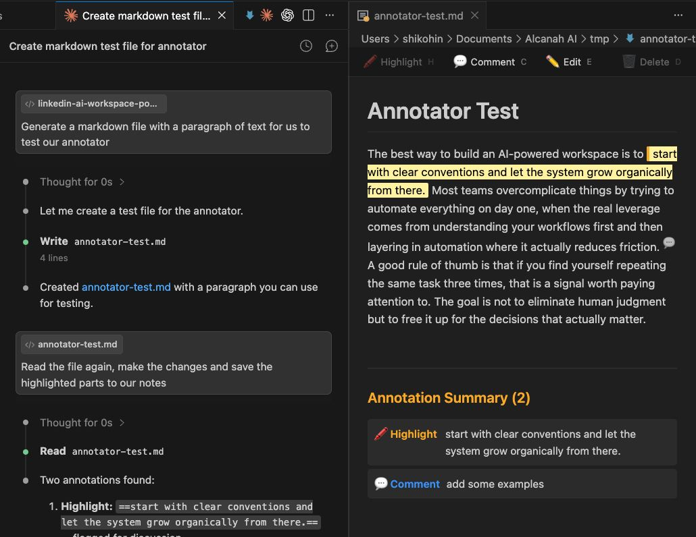

# Ace: AI Markdown Feedback

Annotate Markdown files with structured feedback that LLMs can read and act on.



## The Problem

LLM coding agents generate Markdown artifacts — plans, docs, code explanations. When you want to give feedback, you're stuck writing free-form text or making inline edits that lose context. There's no structured way to say "discuss this", "change that", or "remove this section" in a format the LLM can parse.

## How It Works

Ace adds four annotation types to your Markdown files, all stored as plain-text syntax — no sidecar files, no proprietary format:

| Syntax | Purpose | Preview |
|--------|---------|---------|
| `==highlight this==` | Flag text for discussion | Yellow highlight |
| `%%your note here%%` | Leave a comment for the LLM | Hidden in preview; icon on hover |
| `> [!EDIT] Change X to Y` | Specific edit request | Styled callout block |
| `~~remove this~~` | Suggest deletion | Red strikethrough |

Any LLM can parse these annotations directly from the `.md` source.

## Install

Search **"Ace AI Markdown Feedback"** in the VS Code Extensions sidebar, or install from the [Marketplace](https://marketplace.visualstudio.com/items?itemName=AlfredNaayem.ai-markdown-feedback).

## Quick Start

1. Open any `.md` file in VS Code
2. **Side-by-side mode:** `Cmd+Shift+P` → "Ace: Open Feedback Preview"
3. **Preview-only mode:** Right-click the file → "Open With..." → "AI Markdown Preview"
4. Select text in the preview and annotate:
   - Press `H` — Highlight selection
   - Press `C` — Add comment
   - Press `E` — Suggest edit
   - Press `D` — Mark for deletion
   - Or use the toolbar buttons at the top of the preview
5. `Cmd+Z` in the preview to undo
6. Hand the annotated `.md` file back to your LLM

## Saving

When you annotate from the preview, changes are written to the underlying `.md` file. To save:
- **Preview-only mode** (custom editor): `Cmd+S` saves directly — works like any editor tab
- **Side-by-side mode**: Switch to the code editor tab and `Cmd+S`, or close the tab and confirm save

## Annotation Header

On the first annotation, Ace inserts an instruction header at the top of the file telling AI tools to respect the markers.

**Markdown format** (default) — a visible callout that LLMs can't miss:

```markdown
> [!NOTE]
> **Annotations present.** This file contains reviewer feedback.
> `==highlights==` flag text for discussion. `%%comments%%` are inline notes.
> `~~deletions~~` suggest removal. `> [!EDIT]` blocks are change requests.
> Do not remove these markers — process them as feedback.
```

**HTML format** — a hidden comment (previous default, less reliable with LLMs):

```markdown
<!-- AI Markdown Feedback: This file contains reviewer annotations. ... -->
```

Change the format in settings with `acemd.headerFormat`. The header is removed automatically when all annotations are cleared.

## AI Instructions for Your Config

Run `Cmd+Shift+P` → **"Ace: Copy AI Instructions"** to copy a ready-to-paste snippet explaining all annotation types. Add it to your `CLAUDE.md`, `.cursorrules`, Copilot instructions, or any AI config file to ensure your tools always respect Ace annotations.

## Settings

| Setting | Default | Description |
|---------|---------|-------------|
| `acemd.headerFormat` | `markdown` | Instruction header format: `markdown` (visible callout) or `html` (hidden comment) |
| `acemd.highlightColor` | `#fff3a0` | Background color for highlighted text |
| `acemd.showAnnotationGutter` | `true` | Show annotation markers in the gutter |

## Who It's For

Anyone using LLM coding agents (Claude Code, Codex CLI, Cursor, Copilot) who reviews Markdown output and wants a faster, more structured way to give feedback than rewriting or commenting in chat.

## License

[MIT](LICENSE)
